# 🚀 CareerPilot AI

## Intelligent Placement & Career Intelligence Platform

CareerPilot AI is an AI-powered placement preparation platform designed to help students understand their job readiness, identify skill gaps, practice interviews and coding, follow a personalized career roadmap, and receive context-aware career guidance.

Instead of treating placement preparation as separate tools, CareerPilot AI connects the complete preparation journey into one system:

```text
Resume
  ↓
Resume Intelligence
  ↓
Target Job Analysis
  ↓
Job Match & Skill Gap Analysis
  ↓
Personalized Career Roadmap
  ↓
Mock Interview + Coding Assessment
  ↓
Placement Readiness
  ↓
AI Career Assistant
  ↓
Continuous Progress Tracking
```

---

## ✨ Why CareerPilot AI?

Students often have to use different platforms for resume checking, job matching, interview preparation, coding practice, and career planning.

CareerPilot AI brings these activities together and turns them into a connected preparation workflow.

### Core Goals

**Resume Analysis**  
Analyze a student's resume and ATS readiness.

**Skill Extraction**  
Extract technical and professional skills.

**Job Matching**  
Compare a resume with a target job description.

**Skill Gap Identification**  
Identify missing and important skills.

**Personalized Roadmap**  
Generate a personalized learning roadmap.

**Adaptive Interview Practice**  
Conduct adaptive mock interviews.

**Coding Evaluation**  
Evaluate coding submissions and test cases.

**Placement Readiness**  
Calculate an overall placement readiness score.

**Progress Tracking**  
Track readiness progress over time.

**AI Career Guidance**  
Provide personalized AI career guidance.

**Secure Data Management**  
Maintain authenticated, user-scoped career data.

---

## 🎯 Key Features

| Module | What it does |
|---|---|
| 📄 **Resume Intelligence** | Resume upload, parsing, ATS scoring, skill extraction, projects, education, experience and recommendations |
| 🎯 **Job Match Intelligence** | Compares resume skills with a target job and identifies skill gaps |
| 🗺️ **Career Roadmap** | Converts skill gaps into a structured multi-week learning journey |
| 🎤 **Adaptive AI Interview** | Personalized technical/behavioral practice with difficulty adaptation and performance analysis |
| 💻 **Coding Intelligence** | Coding problems, submissions, test cases, evaluation and coding analytics |
| 📊 **Placement Readiness** | Combines multiple preparation signals into an overall readiness score |
| 📈 **Progress Tracking** | Stores readiness snapshots and visualizes improvement over time |
| 📅 **Daily Learning** | Provides focused daily preparation tasks and progress |
| 🤖 **CareerPilot AI Assistant** | Context-aware career guidance based on resume, target job, skills, readiness and roadmap |
| 🔐 **Authentication** | JWT-based authentication with protected user-specific resources |
| 🛡️ **Secure Data Access** | API ownership checks ensure users access their own career data |

---

# 📸 Screenshots

### 1. Register

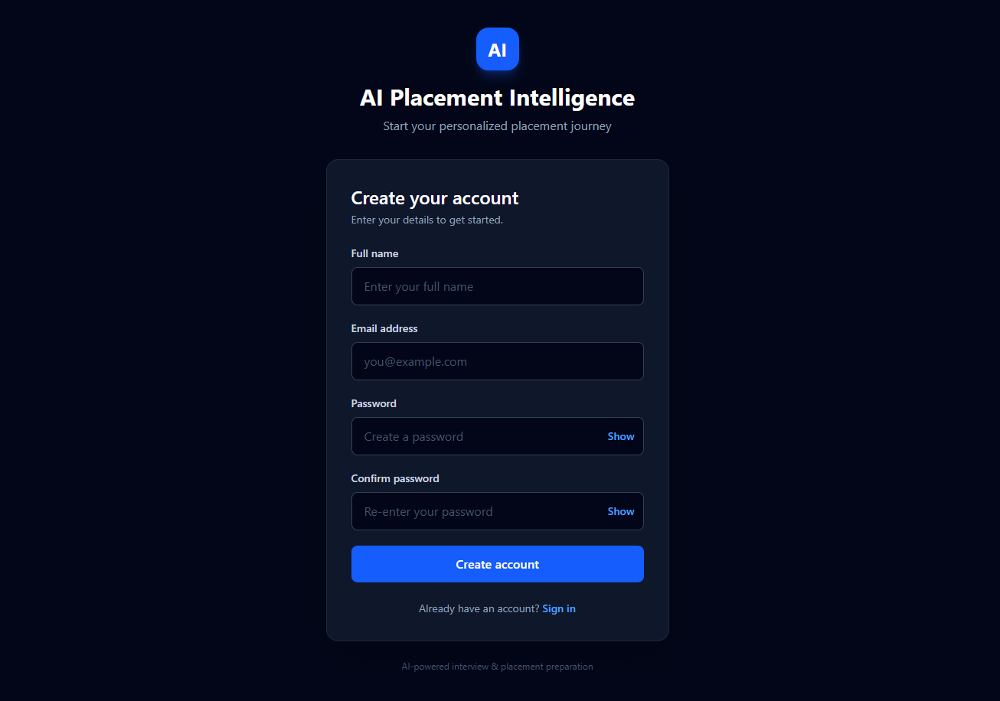

### 2. Login

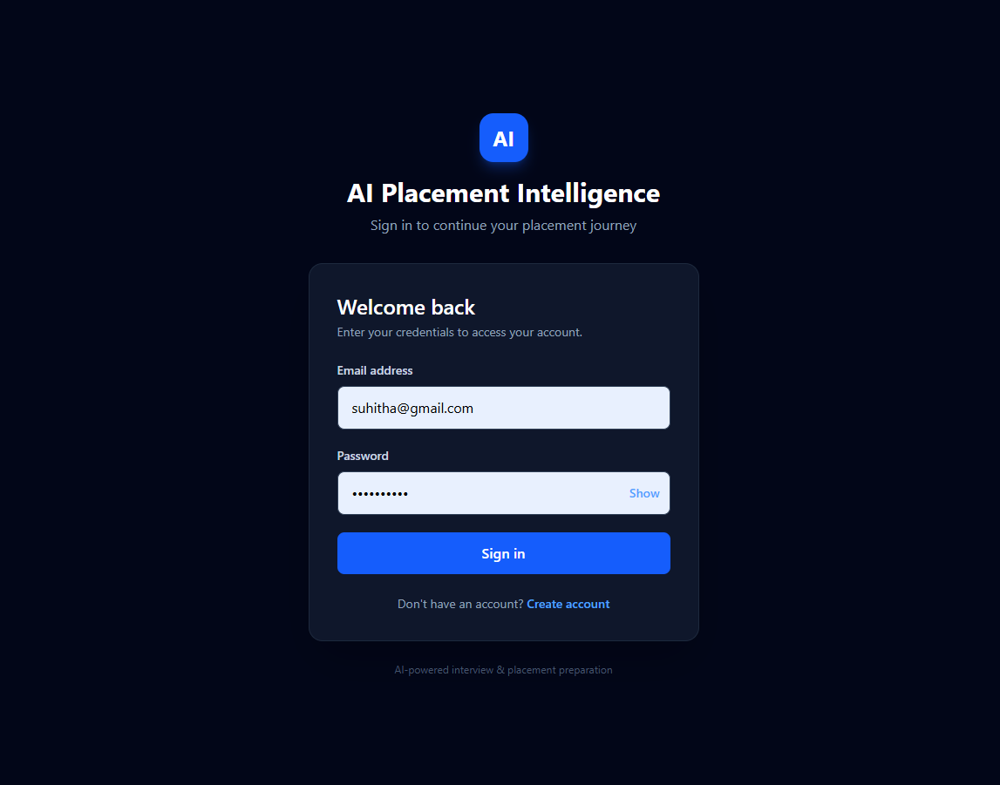

### 3. Dashboard Overview

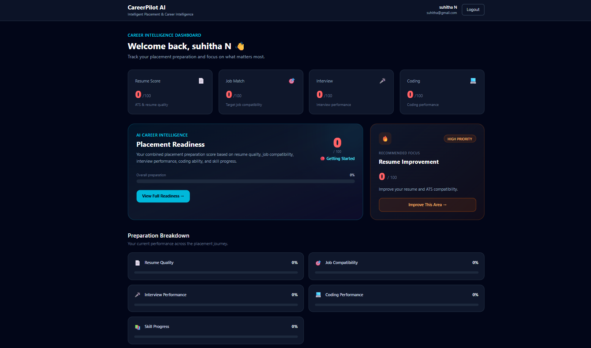

### 4. Dashboard Tools

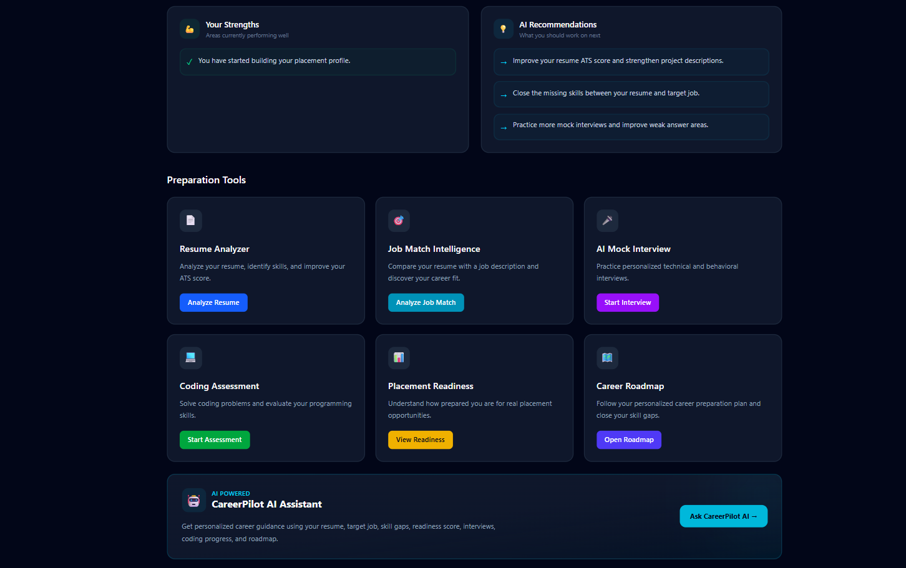

### 5. Resume Analyzer — Upload

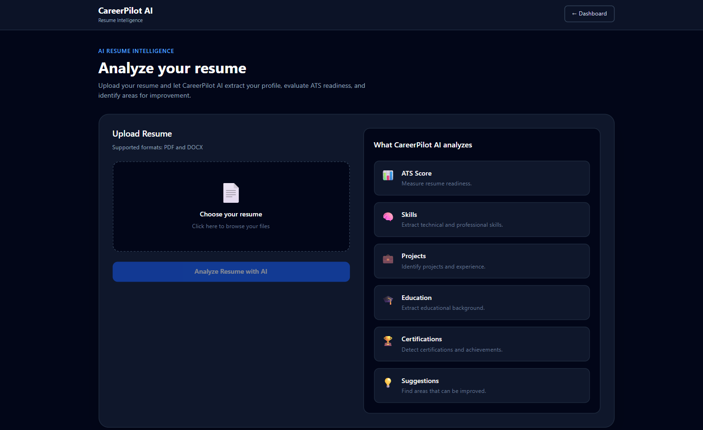

### 6. Resume Analyzer — Results

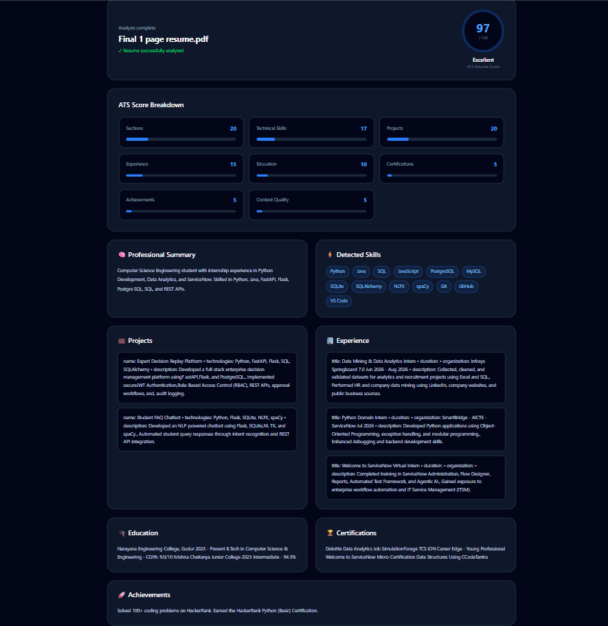

### 7. Job Match Intelligence

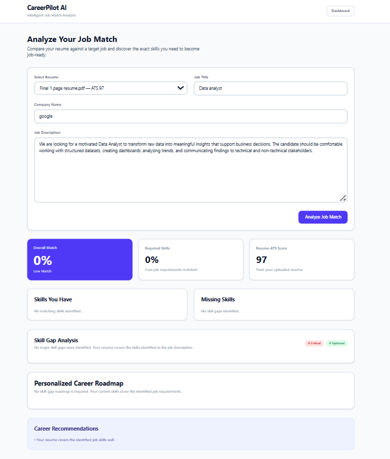

### 8. AI Mock Interview — Setup

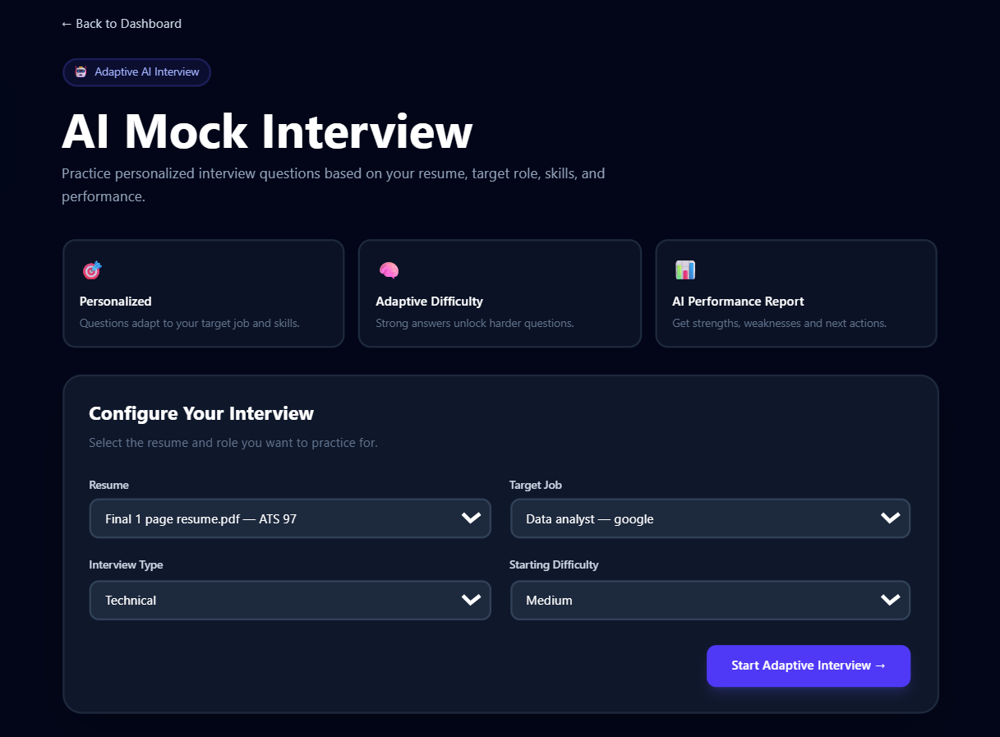

### 9. AI Mock Interview — Performance Report

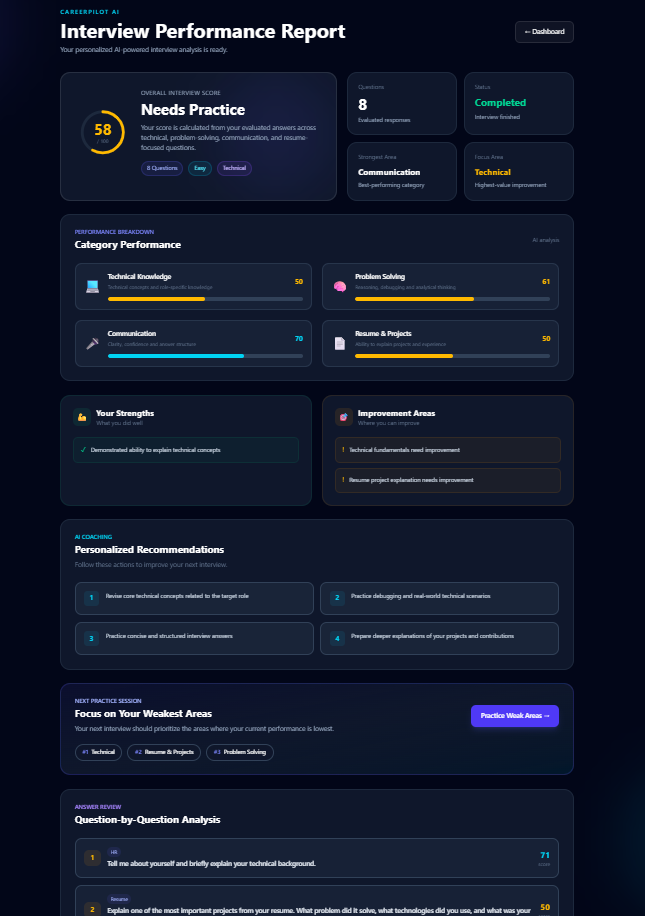

### 10. Coding Assessment

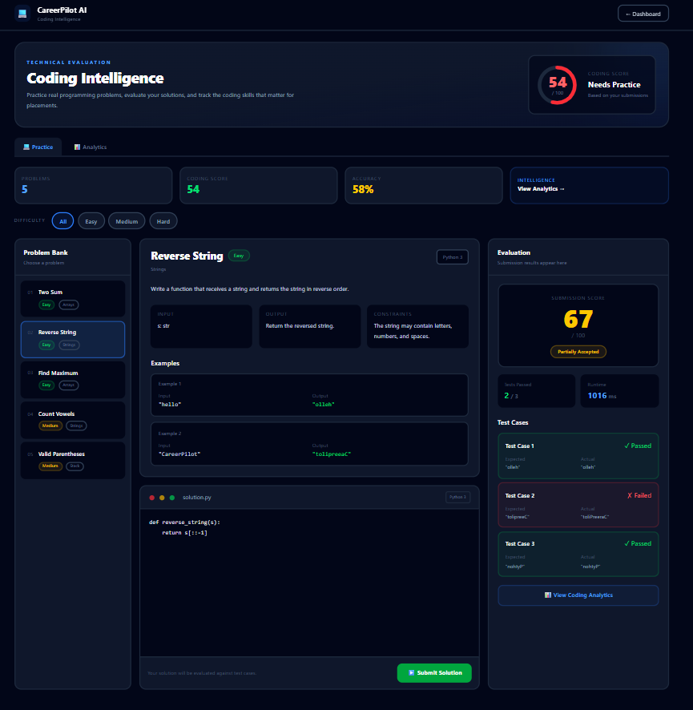

### 11. Career Roadmap

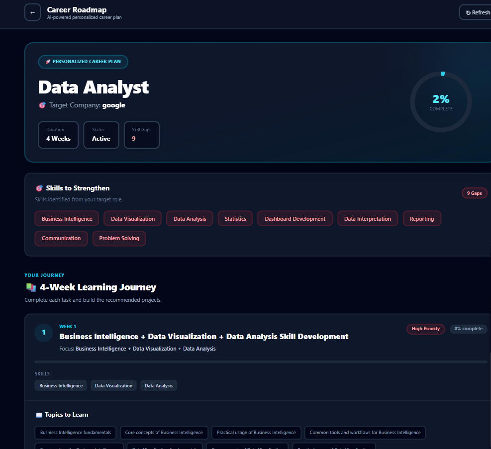

### 12. Placement Readiness

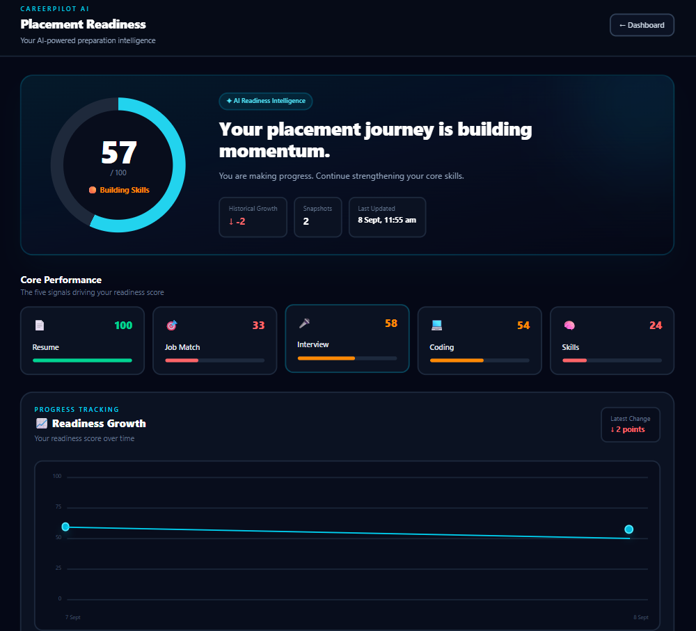

### 13. CareerPilot AI Assistant

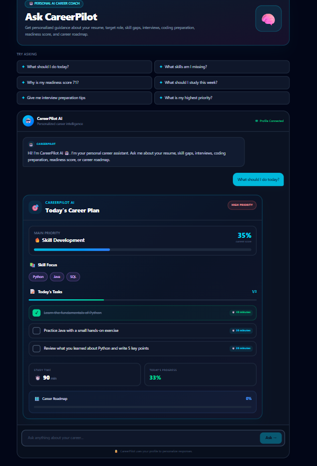

### 14. Final Dashboard Progress

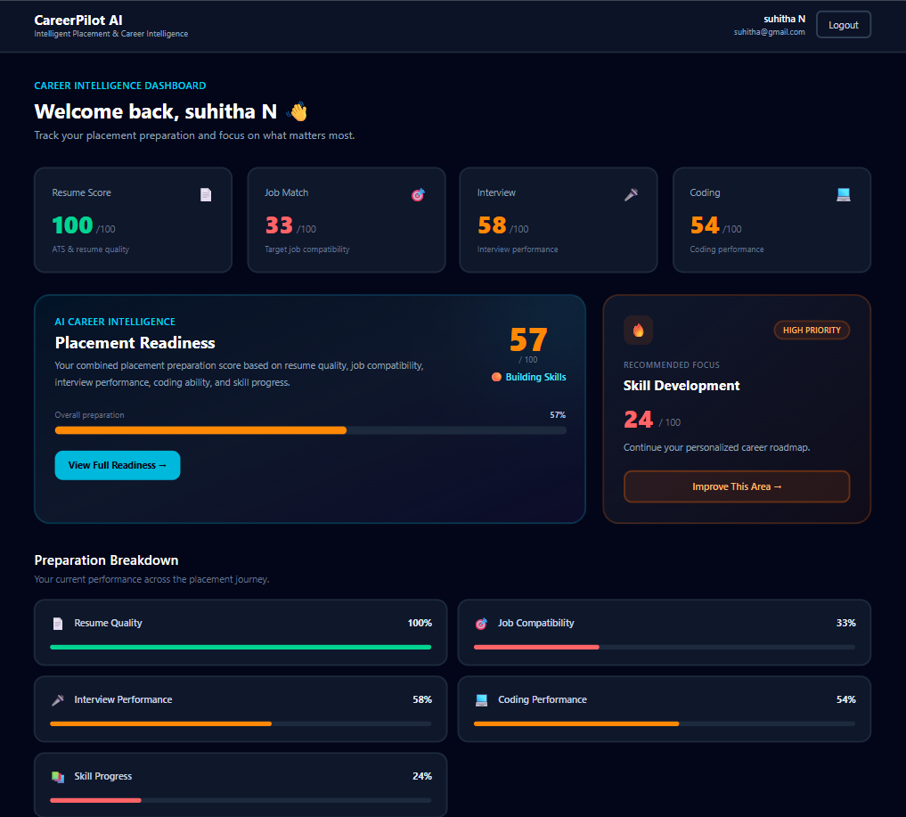

---

# 🧠 AI & Intelligence Layer

CareerPilot AI uses a local AI setup so the project can be developed and demonstrated without depending on paid LLM APIs.

## Local AI

**Ollama**

**Llama 3.2 1B**

**Python AI/service layer**

**Prompt-based career guidance**

**Context-aware responses**

The AI assistant can use information from the user's preparation profile, including:

```text
Resume
Target Job
Skill Gaps
Placement Readiness
Interview Performance
Coding Progress
Career Roadmap
Daily Learning
```

This allows the assistant to provide recommendations that are connected to the student's actual preparation state rather than generic career advice.

---

# 🏗️ System Architecture

```text
                    ┌──────────────────────────┐
                    │       React Frontend      │
                    │   TypeScript + Tailwind   │
                    └────────────┬─────────────┘
                                 │ REST API
                                 ▼
                    ┌──────────────────────────┐
                    │       FastAPI Backend     │
                    │   Authentication + APIs   │
                    └────────────┬─────────────┘
                                 │
              ┌──────────────────┼──────────────────┐
              │                  │                  │
              ▼                  ▼                  ▼
      ┌─────────────┐    ┌──────────────┐    ┌──────────────┐
      │ PostgreSQL  │    │ AI Services  │    │ File Parsing │
      │   Database  │    │   Ollama     │    │ PDF / DOCX   │
      └─────────────┘    └──────────────┘    └──────────────┘
                                 │
                                 ▼
                       ┌────────────────────┐
                       │ Career Intelligence│
                       │ Resume / JD / AI   │
                       │ Interview / Coding │
                       │ Readiness / Roadmap│
                       └────────────────────┘
```

---

# 🛠️ Technology Stack

## Frontend

**React**

**TypeScript**

**Tailwind CSS**

**React Router**

**Vite**

## Backend

**Python**

**FastAPI**

**Uvicorn**

**Pydantic**

**SQLAlchemy**

## Database

**PostgreSQL**

**Alembic migrations**

## AI / NLP

**Ollama**

**Llama 3.2**

**Resume text extraction**

**Job-description skill extraction**

**Rule-based skill normalization**

**Context-aware AI assistance**

## Authentication & Security

**JWT authentication**

**Argon2 password hashing**

**Role-based access concepts**

**User-scoped database queries**

**Protected API endpoints**

**File type and size validation**

**Restricted coding execution**

## DevOps / Development

**Docker**

**Docker Compose**

**Git**

**Environment-based configuration**

---

# 🔐 Security

Security was considered at the API and data-access level.

## Authentication

Users authenticate through JWT tokens.

```text
Register
   ↓
Login
   ↓
JWT Access Token
   ↓
Authenticated API Requests
```

Passwords are hashed using Argon2 rather than stored as plain text.

---

# 👩‍💻 About the Developer

**Suhitha Natakam**

**B.Tech — Computer Science Engineering**

**CareerPilot AI — Intelligent Placement & Career Intelligence Platform**
